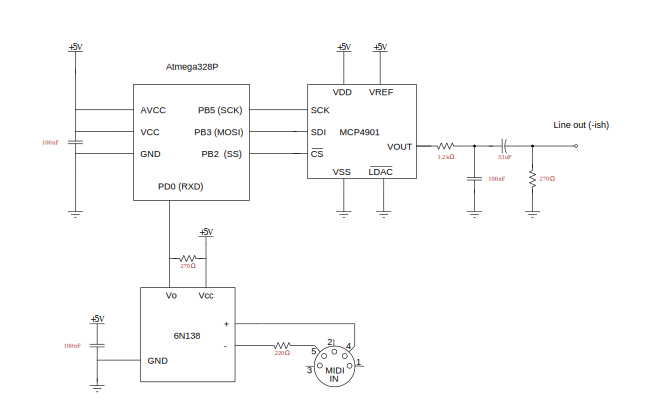

# Simple AVR synthesizer

A wavetable-based synthesizer on an Atmega328P capable of basic MIDI.

## Features
   - 16kHz sample rate
   - audio signal in 8 bit fixed point precision
   - sawtooth signal stored in flash memory as low-pass filtered wavetables to avoid aliasing.
     Tables with different filter cutoffs are generated in Python before compilation.
     The appropriate table for some note is selected at runtime.
   - 6 independent voices 

## Circuit diagram


## Sound examples
[sawtooth](https://github.com/adediego/simpleavrsynth/assets/38465681/408cfc52-642e-4688-9ce7-5746723a80d5)

One can get a more organ-like sound by replacing the function `lowpasssaw` in `codegen/make_saw_table.py` with 
```python
def lowpassorgan(k):
    freqs = np.zeros(256)
    freqs[1:9:2] = [1.0, 1.0, 0.1, 0.1]
    freqs[-7::2] = np.flip(freqs[1:9:2])
    freqs[k+1:-k] = 0
    lowpassed = np.fft.ifft(freqs)
    return np.real(lowpassed)
```
[organ](https://github.com/adediego/simpleavrsynth/assets/38465681/fa10ce6b-4318-4656-9748-8fa99088b527)

## Notes
The `CKDIV8` bit in the low fuse byte (FLB) needs to be unprogrammed (set to `1`) to set the clock frequency to `8 MHz`.
With the other bits left to default, this results in a value of `0xE2` for FLB.
